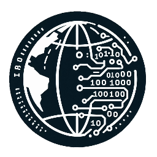

[![Contributors][contributors-shield]][contributors-url]
[![Forks][forks-shield]][forks-url]
[![Stargazers][stars-shield]][stars-url]
[![Issues][issues-shield]][issues-url]
[![MIT License][license-shield]][license-url]
[![LinkedIn][linkedin-shield]][linkedin-url]

<!-- PROJECT LOGO -->
 

  

  <h3 align="center">Best-README-Template</h3>

  

    An awesome README template to jumpstart your projects!
     
    <a href="https://github.com/othneildrew/Best-README-Template"><strong>Explore the docs »</strong></a>
     
     
    <a href="https://github.com/othneildrew/Best-README-Template">View Demo</a>
    ·
    <a href="https://github.com/othneildrew/Best-README-Template/issues/new?labels=bug&template=bug-report---.md">Report Bug</a>
    ·
    <a href="https://github.com/othneildrew/Best-README-Template/issues/new?labels=enhancement&template=feature-request---.md">Request Feature</a>
  

# Introduction to Jam-e-Jamshid
[![Product Name Screen Shot][product-screenshot]](https://example.com)

Jamejam aims to deliver an advanced reverse engineering suite that combines traditional analysis tools with cutting-edge AI capabilities. Jamejam aims to address the shortcomings of existing solutions, such as IDA and Ghidra, by providing a unified platform that includes a hex editor, selective disassembler (Ai000-Disassembler or Capstone), debugger, decompiler, and AI-driven modules for obfuscation detection and isolated program analysis. Through these features, Jamejam enhances accuracy, speed, and usability, enabling users to analyze complex software and malware more efficiently.

# Scope of Jam-e-Jamshid
Jamejam is designed for reverse engineers, security analysts, and software developers who require robust tools for software analysis, malware detection, and code deobfuscation. The software provides core functionalities for analyzing low-level code, debugging, and decompiling alongside AI-powered features like obfuscation detection and behavior analysis in an isolated environment. Integrating Large Language Models (LLMs) further aids users by providing detailed code analysis and summaries.

### Built With

Here we list major frameworks/libraries use to bootstrap jamejam project (It will updated to latest changes). Here are the latest usage:

* 
* 

# Objectives of Jam-e-Jamshid
The key objectives of Jamejam are:
1.	To provide a highly customizable disassembler and debugger, improving upon existing reverse engineering tools.
2.	To integrate AI solutions that can detect and analyze obfuscated code and data automatically.
3.	To introduce an AI-powered sandbox environment where programs are run in isolation, and their behavior is analyzed post-execution.
4.	To leverage LLMs to explain complex code patterns, detect potential vulnerabilities, and summarize key insights for the user.
5.	To enhance usability and performance, ensuring efficient and scalable reverse engineering workflows.

<!-- ROADMAP -->
## Roadmap

- [x] Add Changelog
- [x] Add back to top links
- [ ] Add Additional Templates w/ Examples
- [ ] Add "components" document to easily copy & paste sections of the readme
- [ ] Multi-language Support
    - [ ] Chinese
    - [ ] Spanish

See the [open issues](https://github.com/othneildrew/Best-README-Template/issues) for a full list of proposed features (and known issues).

(<a href="#readme-top">back to top</a>)

<!-- CONTRIBUTING -->
## Contributing

Contributions are what make the open source community such an amazing place to learn, inspire, and create. Any contributions you make are **greatly appreciated**.

If you have a suggestion that would make this better, please fork the repo and create a pull request. You can also simply open an issue with the tag "enhancement".
Don't forget to give the project a star! Thanks again!

1. Fork the Project
2. Create your Feature Branch (`git checkout -b feature/AmazingFeature`)
3. Commit your Changes (`git commit -m 'Add some AmazingFeature'`)
4. Push to the Branch (`git push origin feature/AmazingFeature`)
5. Open a Pull Request

### Top contributors:

(<a href="#readme-top">back to top</a>)

<!-- LICENSE -->
## License

Distributed under the MIT License. See `LICENSE.txt` for more information.

(<a href="#readme-top">back to top</a>)

<!-- CONTACT -->
## Contact

Your Name - [@your_twitter](https://twitter.com/your_username) - email@example.com

Project Link: [https://github.com/your_username/repo_name](https://github.com/your_username/repo_name)

(<a href="#readme-top">back to top</a>)

<!-- MARKDOWN LINKS & IMAGES -->
[contributors-shield]: https://img.shields.io/github/contributors/othneildrew/Best-README-Template.svg?style=for-the-badge
[contributors-url]: https://github.com/othneildrew/Best-README-Template/graphs/contributors
[forks-shield]: https://img.shields.io/github/forks/othneildrew/Best-README-Template.svg?style=for-the-badge
[forks-url]: https://github.com/othneildrew/Best-README-Template/network/members
[stars-shield]: https://img.shields.io/github/stars/othneildrew/Best-README-Template.svg?style=for-the-badge
[stars-url]: https://github.com/othneildrew/Best-README-Template/stargazers
[issues-shield]: https://img.shields.io/github/issues/othneildrew/Best-README-Template.svg?style=for-the-badge
[issues-url]: https://github.com/othneildrew/Best-README-Template/issues
[license-shield]: https://img.shields.io/github/license/othneildrew/Best-README-Template.svg?style=for-the-badge
[license-url]: https://github.com/othneildrew/Best-README-Template/blob/master/LICENSE.txt
[linkedin-shield]: https://img.shields.io/badge/-LinkedIn-black.svg?style=for-the-badge&logo=linkedin&colorB=555
[linkedin-url]: https://linkedin.com/in/othneildrew
[product-screenshot]: git_photos/mainwindow.png
